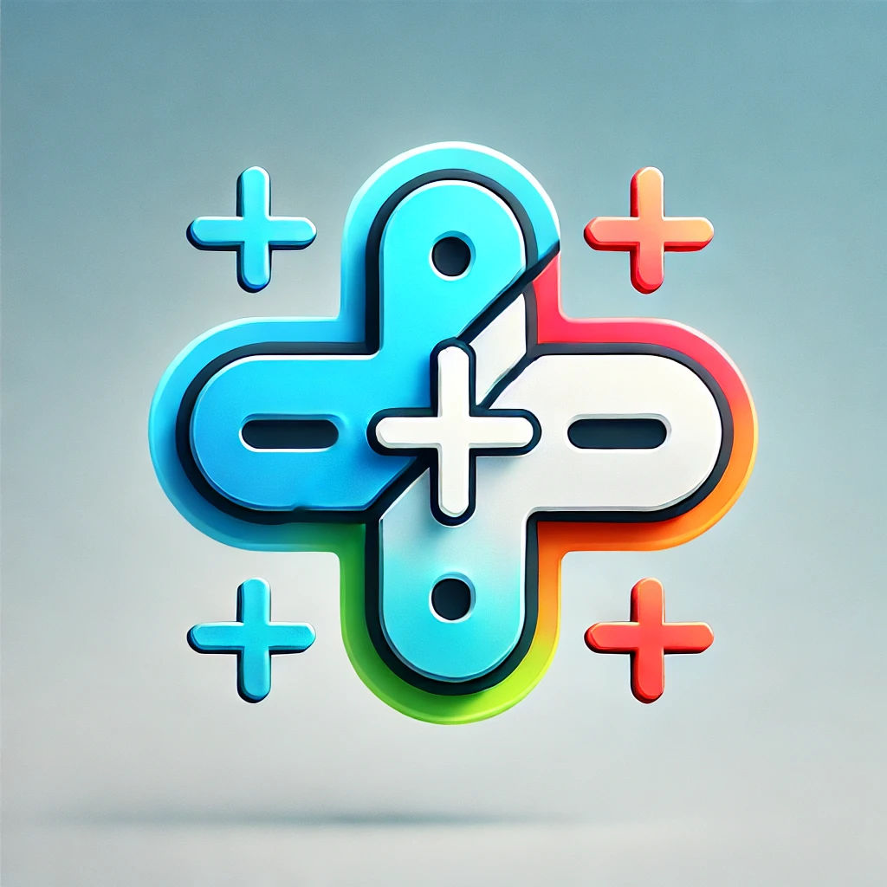

# SumRest

SumRest es una aplicación educativa diseñada para practicar operaciones matemáticas básicas como suma y resta. Los usuarios pueden seleccionar niveles de dificultad, responder preguntas y mejorar sus habilidades matemáticas mientras compiten contra el tiempo.

## Características

- **Operaciones Matemáticas**: Generación de preguntas aleatorias de suma y resta.
- **Niveles de Dificultad**: Fácil, Medio y Difícil.
- **Gestión de Usuarios**: Registro, inicio de sesión y actualización de perfiles.
- **Puntuación y Estadísticas**: Seguimiento de respuestas correctas y totales.
- **Temporizador**: Desafío contra el tiempo para completar las preguntas.
- **Interfaz Gráfica**: Diseñada con JavaFX para una experiencia de usuario intuitiva.

## Requisitos del Sistema

- **Java**: JDK 17 o superior.
- **Maven**: Para la gestión de dependencias.
- **Base de Datos**: SQLite (incluida en el proyecto).